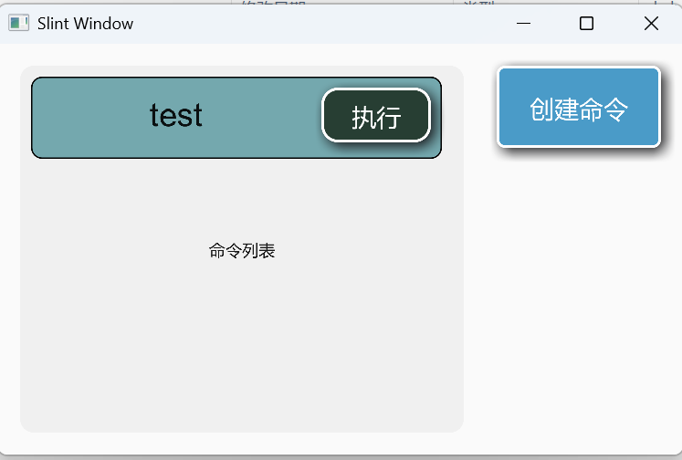

## 使用说明
---
首先得下载一个mqtt broker 运行于 127.0.0.1:1883, 这个app注册于 server/0 主题,客户端向app的主题发送注册信息得以注册设备状态,之后发送更改信息以修改设备状态
## 数据格式
### 设备注册
{
  "id": "node-123",
  "position_type": 2,
  "position": [10.5, 20.3, 5.0],
  "state": {
    "name": "sensor-1",
    "type": "temperature",
    "unit": "celsius"
  }
}
### 修改设备状态
{
  "state_change": {
    "status": "active",
    "mode": "auto",
    "alert": "none"
  }
}
### 发送的命令
{
  "op": "set_values",
  "op_value": {
    "target_temp": 22.0,
    "fan_speed": 75.5,
    "timeout": 300.0
  }
}
### 演示图片

